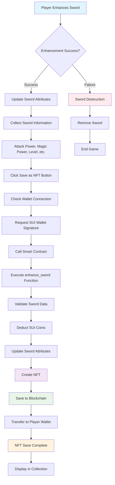

# 🔄 NFT Save Process Visualization

This document explains the process of saving sword information as NFTs using Mermaid diagrams.

## 📊 Flow Diagram



## 📋 Step-by-Step Detailed Explanation

### 1. Gameplay Stage
- **Player Enhances Sword**: Attempt to enhance sword within the game
- **Enhancement Success/Failure Branch**: Success or failure determined by probability

### 2. Data Preparation Stage (On Success)
- **Update Sword Attributes**: Attack power, magic power, level, etc. increase
- **Collect Sword Information**: Gather all updated attributes
- **Validate Attributes**: Verify attack power, magic power, level, rarity, etc.

### 3. User Interaction
- **Click Save as NFT Button**: Player decides to save as NFT
- **Check Wallet Connection**: Verify SUI wallet is connected
- **Request SUI Wallet Signature**: Wallet request for transaction signature

### 4. Blockchain Transaction
- **Call Smart Contract**: Invoke Move contract functions
- **Execute enhance_sword Function**: Smart contract function for sword enhancement

### 5. Smart Contract Processing
- **Validate Sword Data**: Verify validity of passed sword data
- **Deduct SUI Coins**: Deduct enhancement cost and gas fees
- **Update Sword Attributes**: Update sword attributes on blockchain

### 6. NFT Creation and Storage
- **Create NFT**: Generate new NFT object
- **Save to Blockchain**: Permanently store on Sui blockchain
- **Transfer to Player Wallet**: Send NFT to player's wallet

### 7. Completion and Display
- **NFT Save Complete**: Successfully saved NFT
- **Display in Collection**: Visible on collection page

## 🔴 Failure Scenario

### Sword Destruction Process
- **Enhancement Failure**: Enhancement fails based on probability
- **Remove Sword**: Failed sword is permanently destroyed
- **End Game**: Current session ends

## 🎨 Visual Distinction

- **Blue (#e1f5fe)**: Starting point (Gameplay)
- **Purple (#f3e5f5)**: NFT Creation
- **Green (#e8f5e8)**: Blockchain Storage
- **Orange (#fff3e0)**: Completion Status
- **Red (#ffebee)**: Failure/Destruction

## 🔧 Technical Details

### Smart Contract Function
```move
public entry fun enhance_sword(
    sword: &mut HeroSword, 
    payment: &mut Coin<SUI>, 
    ctx: &mut TxContext
)
```

### NFT Structure
```move
struct HeroSword has key, store {
    id: UID,
    name: String,
    level: u64,
    attack_power: u64,
    magic_power: u64,
    enhancement_count: u64,
    rarity: u64,
    success_rate: u64,
    value: u64,
    // ... other attributes
}
```

### Frontend Processing
```typescript
const saveSword = async () => {
  const tx = new Transaction();
  tx.moveCall({
    target: `${swordPackageId}::sword::save_sword_as_nft`,
    arguments: [sword.id]
  });
  
  await signAndExecute({ transaction: tx });
};
```
